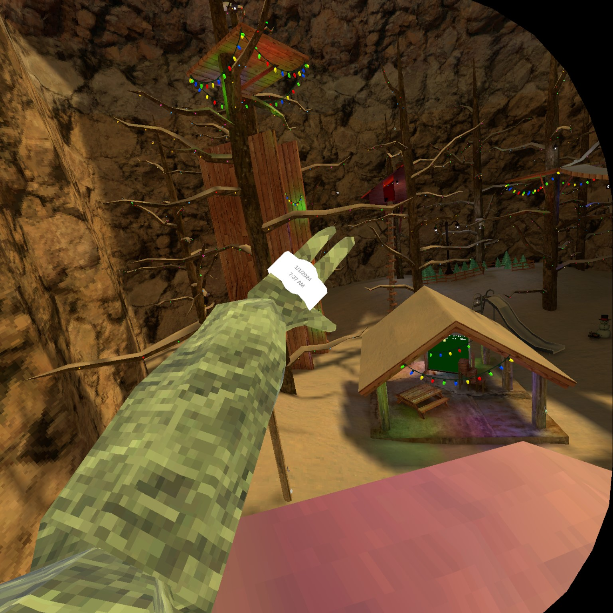

# DateTimeWatch

Watch that shows your Date &amp; Time ingame

# Usage
Install the <a href = "https://github.com/Blas1ed/DateTimeWatch/releases/tag/Release-1">dll<a> into your Bepinex/Plugins folder <a href = "https://www.youtube.com/watch?v=Lu_-PPg6jSk">Vid Tut<a>

# Mod Requirements

1. <a href = "https://github.com/legoandmars/Utilla/releases/tag/v1.6.11">Utilla v1.6.11<a>

2. <a href = "https://github.com/KyleTheScientist/ComputerPlusPlus/releases/tag/v1.0.1">Computer++ v1.01<a>

# Stats

↑ 100 Downloads thnks yall

